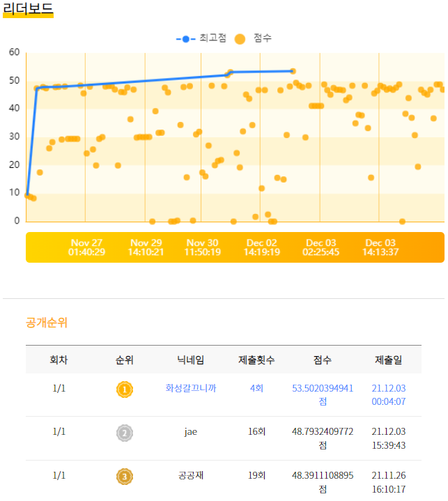

# korean extractive summarization
2021 AI 텍스트 요약 온라인 해커톤 화성갈끄니까팀 코드

## Leaderboard
 

## Notice

+ 본 repo는 uoneway님 [KoBertSum](https://github.com/uoneway/KoBertSum) 레포지토리를 기반으로 만들어졌습니다.
+ 수정된 부분 - pytorch 1.7.1버전 지원하도록 수정.
+ 수정된 부분 - transformers 4.0 버전 지원하도록 수정, klue/roberta-large 포팅
+ 수정된 부분 - 불필요한 부분 삭제 or 수정

## Process

1. Environment Setting
```console
pip install -r requirements.txt
python src/others/install_mecab.py # mecab설치
```

2. Preprocess( ./ext/data/raw/train.jsonl, ./ext/data/raw/test.jsonl이 있어야 함)
```console
python main.py -task make_data -n_cpus 5
```

3. Train
```console
python main.py -task train -target_summary_sent abs -visible_gpus 0
```

4. Validation

- validation 해보려면 다음코드 실행하기. (path에 있는 모델파일 전부 validation하는 코드임.)
```console
python main.py -task valid -model_path 1209_1236
```

5. Test and submission 파일 생성
```console
python main.py -task test -test_from 1209_1236/model_step_500.pt -visible_gpus 0
%cd ext/results/
!python get_submission.py -filename result_1209_1236_step_500.candidate.jsonl
```

## 포함되지 않은 부분

+ 대회에선, ensemble 이용해서 rouge-L 53.15 -> 53.5 으로 끌어올렸는데,
간단하니까 필요하신 분들은 구현해서 사용하시면 성능향상에 도움이 될 듯.

+ 추가로 데이터셋 폼(jsonl각 line)은 이런식으로, 구성됩니다.(세줄요약 데이터셋)
```
{"category": "none", "id": 0, "article_original": ["","","","",""], "extractive": [2, 3, 4], "abstractive": "", "extractive_sents": ["", "", ""]}
```
## Reference
- [uoneway/KoBertSum](https://github.com/uoneway/KoBertSum)
- [nlpyang/PreSumm](https://github.com/nlpyang/PreSumm)
